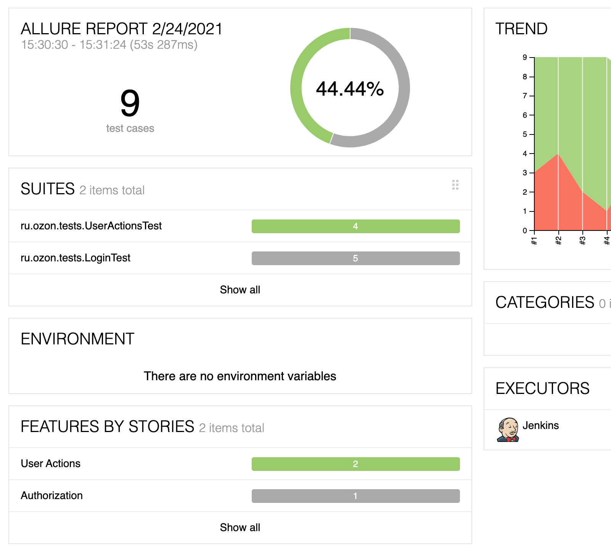
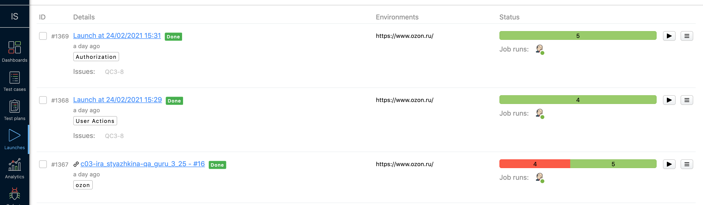
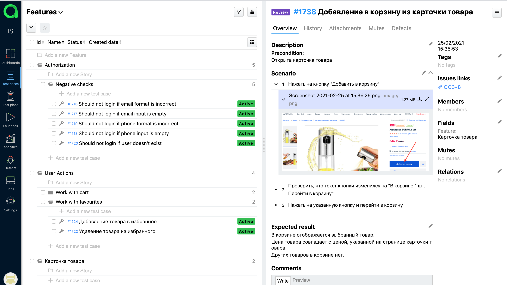
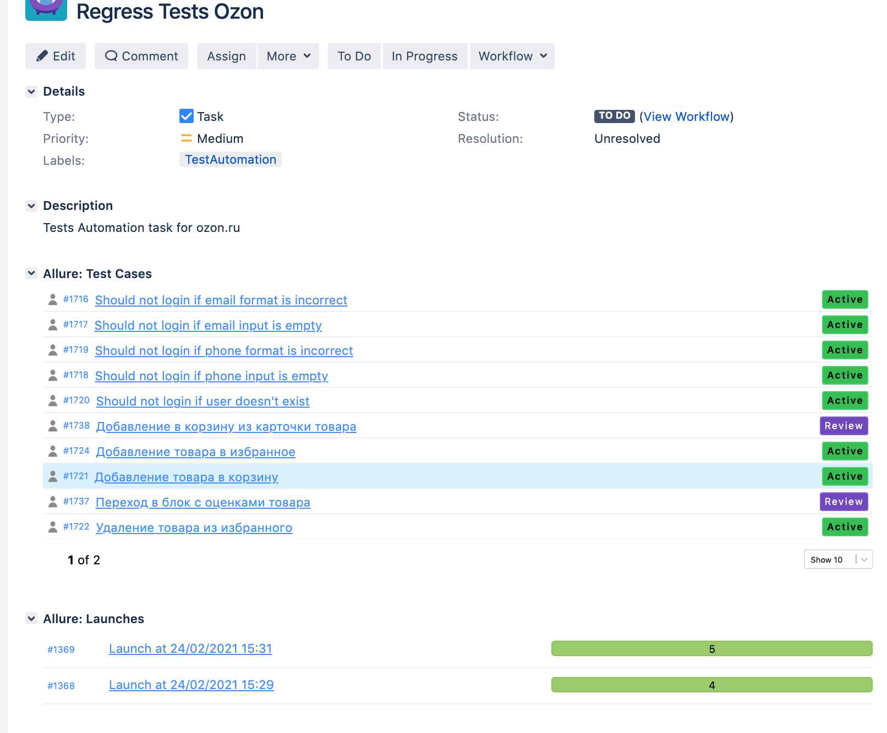
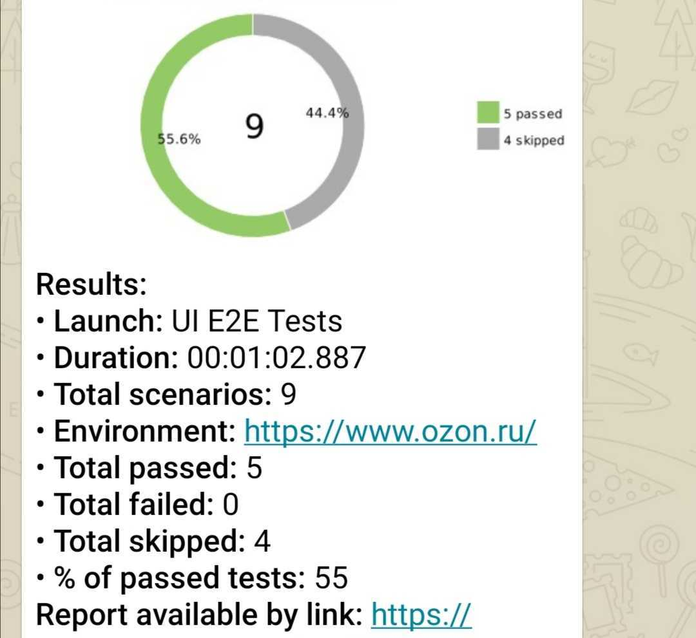
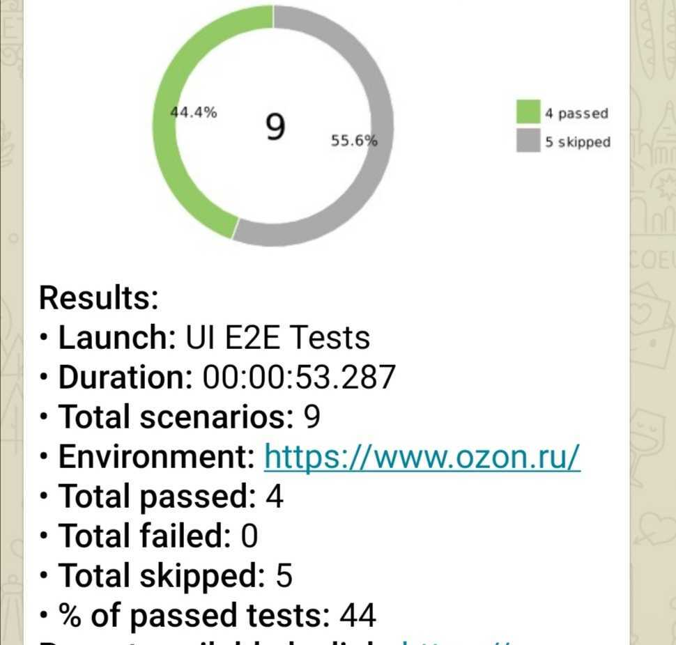

# Project
End-to-end tests

# Technology Stack
Java, JUnit5, Rest Assured, Selenide, Allure SE, Allure TestOps, Jira, Selenoid, Integration with telegram (reports)

# Screenshots

## Allure Report

## Allure TestOps
### Launches
 

### Test Cases
 

## Jira
Task with launches and test cases from Allure TestOps
 

## Telegram Notifications
For Launch with Authorisation tests:
 

For Launch with User Actions tests:
 

